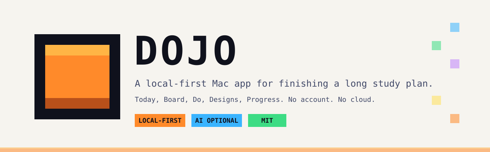
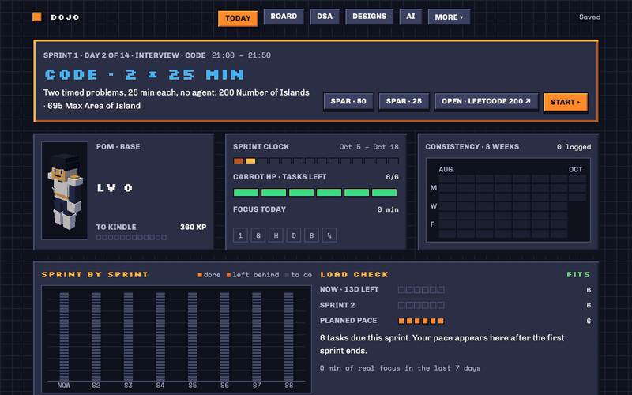
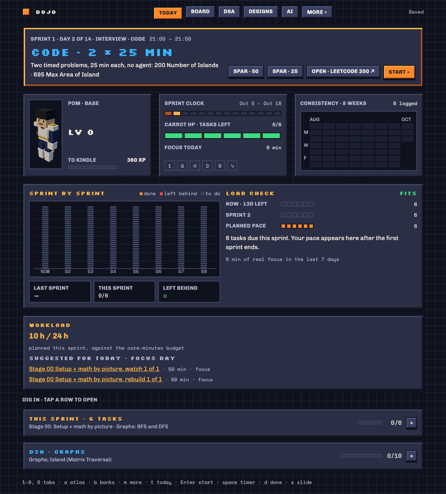
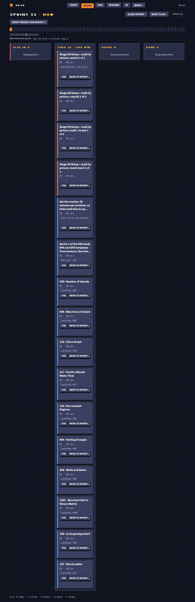
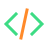
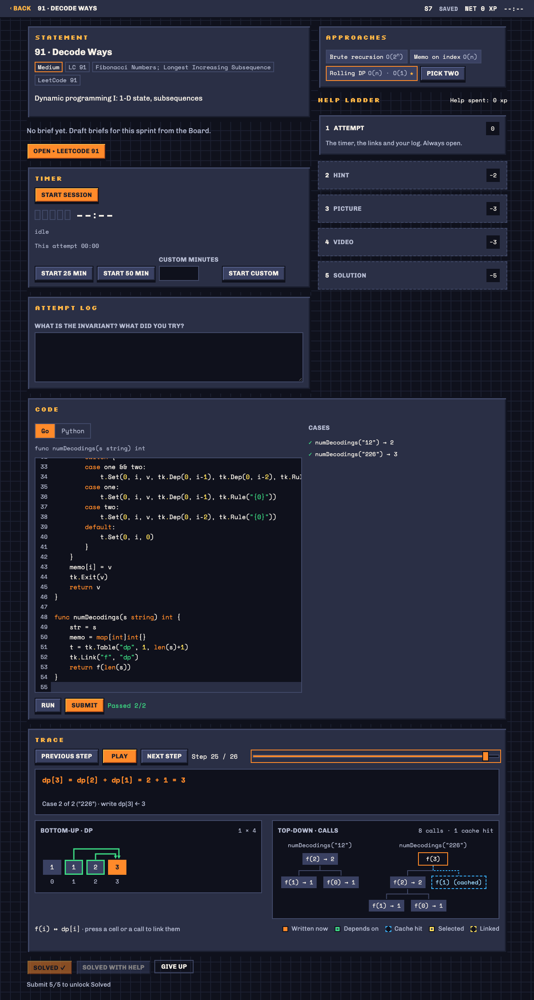
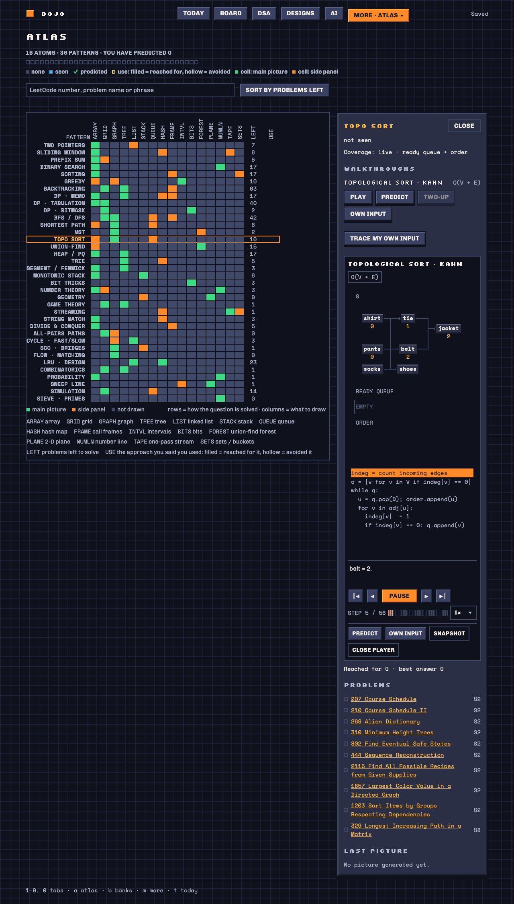
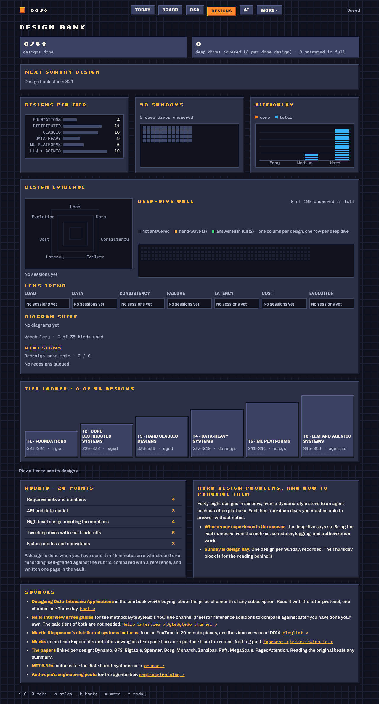
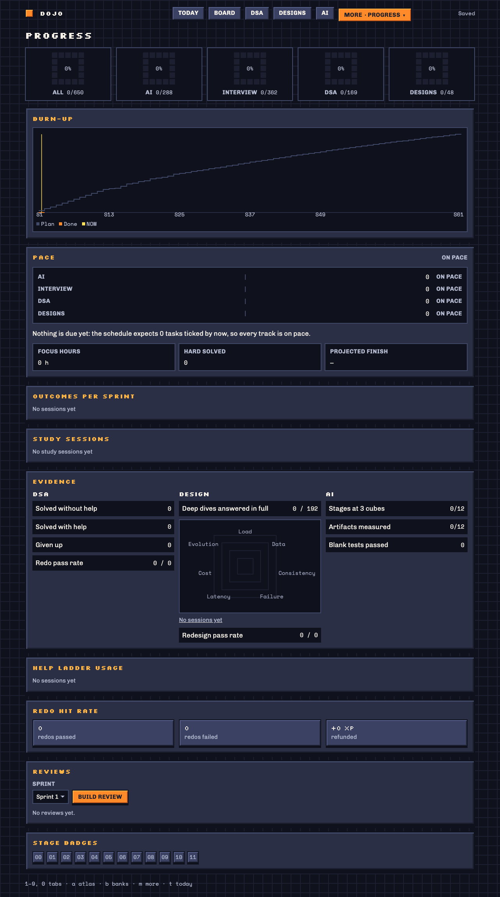

<p align="center">
  <picture>
    <source media="(prefers-color-scheme: dark)" srcset="docs/assets/banner-dark.svg">
    <source media="(prefers-color-scheme: light)" srcset="docs/assets/banner-light.svg">
    
  </picture>
</p>

<p align="center">
  <strong>Today's work, a sprint board, code that runs and is graded on your machine, system-design practice and honest progress, for a study plan that lasts months.</strong>
</p>

<p align="center">
  <a href="LICENSE"></a>
  
  
  
  
</p>

<p align="center">
  
</p>

Dojo takes a study plan that runs for months and turns it into a daily habit you can see. Open it and **Today**
tells you what to do. Press Start and you are working on the card, with a timer, a place to write what you tried and
a code panel that runs your solution. At the end of a sprint it shows you what slipped and what to move.

Your data is one SQLite file in a folder on your Mac. There is no account, no cloud and no telemetry. The AI help is
optional and goes through your own [Claude Code](https://docs.claude.com/en/docs/claude-code) login.

**Jump to:** [Why](#why-dojo-exists) · [A day in Dojo](#a-day-in-dojo) · [Features](#what-it-does) ·
[Is and isn't](#what-dojo-is-and-isnt) · [Quick start](#quick-start) · [Your own plan](#bring-your-own-plan) ·
[Privacy](#privacy-and-your-data) · [FAQ](#faq) · [Roadmap](#roadmap)

## Why Dojo exists

I built Dojo for myself. I am a working engineer, and I study on evenings and weekends. My plan was long: months of
systems, data structures and algorithms, and AI engineering, cut into two-week sprints. A plan like that does not
fail on day one. It fails around week six, when you cannot tell what you were meant to do today, which cards you
dropped, or whether you are really on pace.

I tried the usual tools.

- **A spreadsheet** held the plan, but it could not tell me what to do today. It also could not move the cards I
  skipped.
- **Notion** was good for notes. A board is not a plan, though, and nothing in it timed a session or counted a
  redo.
- **LeetCode in a browser tab** let me solve problems, but it knew nothing about my plan. It could not tell me I was
  leaning on hints.
- **Flashcards** are fine for facts. They are a poor fit for "rebuild this from a blank file" or "design this in 45
  minutes".

So I ended up with ten tabs and a lot of guilt. What I wanted was one place that knew the whole plan, showed
today's work, and let me do the work without leaving. It should also be honest about progress: how much help I used,
what I gave up on, and what is due for another try.

Dojo is that place. It is a tool for one person with a long plan. It is not a course, and it does not teach you the
material. It gives your plan structure and keeps you doing it.

## A day in Dojo

Five screens cover most days. The shipped sample plan is what you see below. The screenshots were taken from a fresh
data folder with no personal data.

###  1. Today: what do I do now?



Open Dojo and the first screen answers that question. The **Now** tile shows the day's role from the weekly rotation
(for example "Interview, code: two timed problems") and your study block. **Start** opens the card. Underneath
you get your level and XP, the **sprint clock** (a strip of the sprint's 14 days), an eight-week consistency
calendar, and a **load check**: does this sprint still fit in your time budget? If it does not, Dojo can propose
which cards to push to the next sprint.

###  2. Board: the sprint at a glance



The board shows one sprint at a time: Slid in, Todo, Doing and Done. Drag cards, or use the keyboard. When a sprint
ends, its unfinished cards roll into the current one and keep their history. You can slide a card, slide the whole
sprint, shift the plan, pin a card so it is never moved, and undo the last 20 moves. If a sprint is over budget,
**Rebalance** proposes what to move, and you pick what to accept.

###  3. Do: the work itself



This is the focused screen: a timer, an attempt log ("What is the invariant? What did you try?") and, for problems,
a code panel. Write Go or Python, press **Run** for the examples or **Submit** for every case. Both run on your
Mac. **Solved** stays locked until a Submit passes all the cases.

If you get stuck, there is a **help ladder**: attempt, hint, picture, video, solution. Each rung costs XP, and the
solution only opens after you give up. Giving up, or solving with deep help, schedules a **redo** three days later,
then ten, then thirty. A redo only passes if you solve it again with at most a hint. The help you used is on the
record, so your progress numbers stay honest.

If you use Dojo's small `tk` toolkit in your code, the **Trace** panel replays the run step by step. It shows a
DP table with its dependency arrows, a call tree, or a graph, heap or queue. Seeing why `dp[3] = dp[2] + dp[1]` is
worth more than reading it.

<details>
<summary><strong>The picture player (Atlas walkthroughs)</strong></summary>

The Atlas maps algorithm patterns. Each pattern has walkthroughs you can play, but you can also **predict** the next
step first, run your **own input**, compare two walkthroughs side by side, and save a snapshot as a PNG.



</details>

###  4. Designs: practise system design against a clock



Pick a design from the tiered bank and start a 45-minute session. Draw your architecture on the canvas, solo or with
an AI interviewer who asks questions in a chat panel. Then answer five closing questions and score yourself on a
20-point rubric and seven lenses: load, data, consistency, failure, latency, cost and evolution. At the end you see
your diagram next to a reference diagram, with the differences listed. It is information, not a grade. A weak
design comes back for a redesign 30 days later.

###  5. Progress: where am I, really?



Rings per track, a burn-up chart of planned against done, and a pace readout (ahead, on pace or behind, with a
projected finish sprint). You also see how often you needed each rung of the help ladder, and your redo hit rate.
At the end of each sprint, Dojo builds a **review**. It computes the numbers itself. If you have Claude Code, the AI
writes the prose and a short "do better next sprint" list.

## What it does

<table>
<tr>
<td valign="top" width="50%">

**Plan and schedule**
- 72 two-week sprints, each with its own AI-track and interview-track cards
- A weekly rotation: each weekday has a role
- Today, Board, Week, Map (phases, sprint path, skill tree) and Overview
- Workload budget, automatic roll-over, Slide, Shift, Pin, Rebalance and Undo
- A skill tree where a skill unlocks once what it needs is 70% done

**Do the work**
- A timer, study sessions with focus and break blocks and an optional chime, and focus mode
- An attempt log for every card
- A help ladder that costs XP, and redos on a 3, 10 and 30 day schedule
- **Briefs** for cards (a goal, steps, minutes, a deliverable) and a learning check before a watch or read card counts as done

</td>
<td valign="top" width="50%">

**Practise**
- Go and Python runners with a Run and Submit loop, 20 problems with ready-made test packs
- Step-by-step traces of your own code (DP tables, call trees, graphs, heaps, queues and more)
- Atlas: 36 algorithm patterns and 45 walkthroughs
- A DSA bank page with a topic heatmap, and **Banks** with your own list ("Mine")
- A design bank of 48 designs in tiers, timed sessions, an AI interviewer and PNG export

**See progress**
- XP, levels and forms, with a cost for help so numbers stay honest
- Burn-up chart, pace per track and a projected finish
- Consistency calendar, outcomes per sprint and redo hit rate
- Sprint reviews, and Markdown export of the measures you collect on the AI capstone

</td>
</tr>
</table>

<details>
<summary><strong>Optional AI features (all through your own Claude Code login)</strong></summary>

Hints (two levels), picture walkthroughs, architecture diagrams, solutions after you give up, the design
interviewer and its grade, grading of artifacts you build, "ask what to slide", classifying a problem you add,
drafting briefs, learning checks and sprint review prose. Outputs are validated, and guardrails keep, for example, the
full solution behind **Give up**. For build cards in the AI track the AI never writes your code.

Everything not on that list works without Claude Code.

</details>

<details>
<summary><strong>Keyboard-first</strong></summary>

`1` to `9` and `0` jump between screens, `a` opens Atlas, `b` Banks, `m` the More menu. On Today, Enter starts the
card. On the Board, `d` marks done and `s` slides. The [user guide](USER-GUIDE.md#keyboard-shortcuts) has the full
list.

</details>

## What Dojo is and isn't

| Dojo is | Dojo is not |
|---|---|
| A Mac app for **macOS 13 or later**. Tested on **Apple silicon only**. | A Windows, Linux or Intel Mac app. Those are not supported or tested. |
| **Single user, one machine.** One data folder, one window. | A synced or shared app. There is no sync between devices and no team mode. |
| **Local.** Data in `~/Dojo`, a server inside the app on `127.0.0.1`. | A cloud service. There is no account, no sign-in and no telemetry. |
| **Built on your Mac** by `npm run install:app`, then signed ad hoc. | A signed, notarized download. There is no installer to download yet. macOS may ask you to approve it once. |
| A place to **do** practice: run Go and Python, trace it, redo it. | A course. It does not teach you the material or host lessons. |
| **Optional AI** through your own `claude` CLI login. | An AI product. No API key, no account of its own. Without Claude Code, AI panels say so and the rest works. |
| Shipped with a **generic sample plan** you can replace. | Tied to the sample. Bring your own plan (see below). |
| Honest about **problem lists**: see the note below. | A bundle of NeetCode, Blind 75, Striver or similar lists. None ship. |

**About problem lists.** Dojo does not bundle third-party problem collections, and it does not carry full problem
statements: each card links to the original page. The sample plan's DSA bank is the plan's own list: problem numbers and names with links back to LeetCode.
Of those, 20 have local test packs (a signature, a short starter and test cases) so you can Run and Submit in Dojo; for the rest you work on the original site and tick the card.
To add problems of your own, open **Banks > Mine**, paste a LeetCode or Codeforces link or type a name, press
**Classify** (this uses the optional AI), and accept. It becomes a card with its own XP.

**Needs the network?** Not to run. Links you open go through your browser, a brief's optional **Check links** makes
requests to those links, and AI features send their prompts via the `claude` CLI.

## Quick start

You need an Apple silicon Mac on macOS 13 or later, `git`, and Node.js 22.13 or later with npm. Go (1.22 or later)
is optional and only needed for the Go runner. Claude Code is optional and only needed for AI features.
Python needs nothing: its runtime is bundled.

Clone the repository:

```bash
git clone https://github.com/pratikgh0se/dojo.git
cd dojo
```

Install the packages. This also downloads the Electron runtime, several hundred MB on disk:

```bash
npm ci
```

Build the app and install it to `~/Applications/Dojo.app`:

```bash
npm run install:app
```

Open it:

```bash
open ~/Applications/Dojo.app
```

Re-running `npm run install:app` after a `git pull` updates the app and never touches your data.

If macOS refuses to open the app the first time, see
[Troubleshooting](TROUBLESHOOTING.md#macos-says-dojo-cannot-be-opened). In short, right-click it in Finder, choose
**Open**, and confirm.

### What you will see on first launch

1. Dojo creates `~/Dojo` and opens a single window.
2. **Pick your start date.** It defaults to the next Monday. Sprint 1 of 72 begins that day at local midnight, and you
   can change the date later in Settings.
3. Dojo loads the sample plan and opens on **Today**. Press **Start** on the Now tile, or open **Board** (key `2`) to
   see the sprint.

That is all the setup there is. Work through the [user guide](USER-GUIDE.md) when you want the details.

<details>
<summary><strong>Want to look around without installing the app?</strong></summary>

A development mode runs the same interface in a browser tab, with a built-in fake AI and a scratch data folder. It
never touches `~/Dojo`:

```bash
npm run dev
```

Then open http://127.0.0.1:8790. This is meant for contributors, so nothing is saved to your real data and the AI
answers are canned. See [CONTRIBUTING.md](CONTRIBUTING.md).

</details>

<details>
<summary><strong>Install options and removing the app</strong></summary>

Pass options after `--`, for example `npm run install:app -- --dest ~/Desktop`.

| Option | Default | What |
|---|---|---|
| `--dest <dir>` | `~/Applications` | Where to put `Dojo.app`. |
| `--home <dir>` | `$DOJO_HOME` or `~/Dojo` | The data folder, baked into that copy of the app. |
| `--no-icon` | | Skip building the Dock icon. |
| `--no-build` | | Reuse an existing web build instead of building one. |

To remove the app (your data stays):

```bash
npm run uninstall:app
```

</details>

<details>
<summary><strong>Prerequisites in detail</strong></summary>

| What | Version | Needed for |
|---|---|---|
| macOS on Apple silicon | 13 Ventura or later | Everything. The Go runner uses macOS's built-in `sandbox-exec`, and the installer uses `sips`, `iconutil` and `codesign`. |
| Node.js with npm | 22.13 or later | Building and installing (the server uses the built-in `node:sqlite`). The installed app runs on Electron's own Node. |
| git | any | Cloning the repo. |
| Go | 1.22 or later | Optional. The Go runner. Without it, Run and Submit say Go is missing and everything else works. |
| Claude Code (`claude`), logged in | a current release | Optional. The AI features. |

Not needed: Chrome, Python, Docker, a database server, or any API key. The app finds `go` and `claude` itself,
because an app opened from the Dock gets no shell `PATH`.

</details>

## Bring your own plan

The sample plan is the file `public/data/plan.json`. It is plain JSON: **sprints** (each with an AI task list and an
interview task list), a weekly **rotation**, **phases**, a **skill tree**, a **DSA bank** by topic, a **design bank** in
tiers, a shelf of extra resources, and a list of communities. To use your own:

1. Edit or replace `public/data/plan.json`.
2. Run `npm run install:app` again and reopen Dojo.

On every start Dojo reconciles your cards with the plan. Progress on cards whose id is still there is kept and their
text refreshed. New ids become new cards. Cards whose id left the plan are archived and keep their XP. To rename an id
without losing history, add an `idMap` entry.

A few limits, all documented: sprints are always 14 days and the plan is laid out over 72 sprints, and every id has to
be unique. If the file cannot be used, Dojo shows a **Plan data problem** with the reason and does not load half a plan.

Your day, your study block and your project repo go in an optional `~/Dojo/profile.json`, so you can change them
without editing the plan. Full details: [Your own plan](USER-GUIDE.md#your-own-plan),
[Your profile file](USER-GUIDE.md#your-profile-file) and the
[plan data model](docs/ARCHITECTURE.md#the-plan-data-model).

## Privacy and your data


- **Where it lives.** `~/Dojo` (or the folder you chose at install). **Help > Open Data Folder** opens it.
- **No account, no cloud, no telemetry.** Dojo's server listens only on `127.0.0.1`, on a free port that your network
  cannot reach. There is no sync service to sign in to.
- **What the app requests itself.** The only outbound requests are the optional **Check links** on a brief, which only
  accepts public web addresses. Fonts and the Python runtime ship inside the app.
- **AI is the one exception, and only if you use it.** Dojo runs your own `claude` command with your existing login.
  It stores no key. The text of each request (card text, your notes and answers, and for grading a summary of your
  project repo's recent commits) goes to Anthropic, as in any Claude Code session. The
  [user guide](USER-GUIDE.md#ai-features) lists exactly what is sent.
- **Code you run is sandboxed.** Go runs under the macOS sandbox with no network, no access to your home folder, a
  3-second time limit and a memory limit. Python runs in an isolated frame inside the app.

| Path | What |
|---|---|
| `~/Dojo/dojo.db` | Your progress, in SQLite. The source of truth. |
| `~/Dojo/backups/` | A daily snapshot, plus any you take with **Settings > Backups > Back up now**. The newest 30 of each are kept. |
| `~/Dojo/logs/` | The app's logs. |
| `~/Dojo/profile.json` | Optional. Your own schedule and project repo. |

**Back up.** Dojo snapshots daily. To keep a copy off the machine, copy `~/Dojo/backups` to another disk. Each
snapshot is a complete SQLite database, and **Restore** in Settings brings one back (it saves your current data first).
You can also export everything as Postgres SQL with `npm run db:export-pg`.

**Delete it.** Quit Dojo and delete the `~/Dojo` folder. That removes your data. Copy `~/Dojo/backups` somewhere
first if you might want it back. To remove the app too, run `npm run uninstall:app`. For a full clean-up, macOS may
also keep small files named after the app id `local.dojo.app` (a preferences file and saved window state). Delete
those as well.

**Start fresh.** Rename `~/Dojo` to something else. The next launch creates a new empty folder and asks for a start
date again.

## FAQ

<details>
<summary><strong>Do I need Claude Code or an API key?</strong></summary>

No key, ever. Claude Code is optional. Without it, the AI panels tell you it is not installed and everything else
(Today, Board, runners, traces, design sessions, progress, backups) works. With it, Dojo uses your login.
</details>

<details>
<summary><strong>Is it on the App Store, or is there a download?</strong></summary>

No. You build it on your own Mac with `npm run install:app`. It is signed ad hoc and not notarized, so macOS may ask
you to approve it the first time. [Troubleshooting](TROUBLESHOOTING.md#macos-says-dojo-cannot-be-opened) has the steps.
</details>

<details>
<summary><strong>Does it work on Windows, Linux or an Intel Mac?</strong></summary>

Not today, and these are not tested. The Go runner depends on macOS's sandbox, and the app is a Mac app. I tested on
Apple silicon only.
</details>

<details>
<summary><strong>Does it send my data anywhere?</strong></summary>

Not on its own. There is no account, no sync and no telemetry. The one thing that leaves your Mac is what you choose
to send to Claude through AI features. See [Privacy and your data](#privacy-and-your-data).
</details>

<details>
<summary><strong>Can I use it for something other than DSA, systems and AI?</strong></summary>

The plan is just data, so you can write your own sprints and cards. Some parts are specific to the sample, though:
the DSA and Designs screens, the code runner and the skill tree expect those kinds of content. A plan with empty DSA
and design banks works (those tabs say so), but then you mostly use Today, Board and Progress.
</details>

<details>
<summary><strong>Where are the LeetCode and NeetCode lists?</strong></summary>

Not bundled. The sample plan lists its own problems by number and name with links to the original site, and 20 of them
have local test packs. For your own problems, use **Banks > Mine**. See
[About problem lists](#what-dojo-is-and-isnt).
</details>

<details>
<summary><strong>What if my plan changes halfway through?</strong></summary>

Edit `public/data/plan.json` and reinstall. Cards are matched by id, so progress on the ones that remain is kept.
Cards you removed are archived with their XP. Use `idMap` to rename without losing history.
</details>

<details>
<summary><strong>Can I use it on my iPhone, or on two computers?</strong></summary>

Not yet. That is the next planned step: see the [roadmap](#roadmap).
</details>

<details>
<summary><strong>What happens to my data if I update?</strong></summary>

`npm run install:app` replaces only the app bundle. Your data folder is never touched, and Dojo also keeps a daily
snapshot.
</details>

<details>
<summary><strong>Something broke. Where do I look?</strong></summary>

Start with **Help > Open Logs Folder**, then [TROUBLESHOOTING.md](TROUBLESHOOTING.md). It covers install failures,
startup messages, saving problems, AI messages and the code runners.
</details>

## Roadmap

**Planned, not promised.** I work on Dojo in my own time, so treat this as a direction, not a schedule.

- **Multi-platform.** One Dojo server running on your home network, with clients on Mac, iPhone and iPad as a web
  app. Your data would still stay on your own machine, with no cloud service. This is a design direction I want to
  explore. It does not exist yet, and I have not set a date.
- **A download you do not have to build.** A signed, notarized release would remove the Node step. It would also
  need a decision about distribution that has not been made.
- **More sample content.** There are known gaps in the walkthrough library. For example, the Decode Ways problem has
  no walkthrough picture of its own yet (see [docs/known-content-gaps.md](docs/known-content-gaps.md)).

Ideas and bug reports are welcome as issues.

## Contributing

Dojo is a small, local-first app, and changes are welcome as issues and pull requests. Start with
[docs/ARCHITECTURE.md](docs/ARCHITECTURE.md) for how the pieces fit, then [CONTRIBUTING.md](CONTRIBUTING.md) for the
setup, the development commands and the test suites (unit, end-to-end and desktop). The conventions are short: stay
local-first (no telemetry, no API keys), add tests with your change, and keep personal data out of the tree.

Other docs: [User guide](USER-GUIDE.md) (every screen), [Troubleshooting](TROUBLESHOOTING.md),
[Changelog](CHANGELOG.md).

## Licence and acknowledgements

Dojo is released under the [MIT License](LICENSE).

It stands on other people's work: Electron and Chromium, React, CodeMirror, Dexie, Pyodide (the Python runtime, under
MPL-2.0), three.js, and the self-hosted Chivo, Silkscreen and Space Mono fonts, among others. Each keeps its own
licence. See [THIRD-PARTY-NOTICES.md](THIRD-PARTY-NOTICES.md). The installed app carries Electron's and Chromium's
licences in `Dojo.app/Contents/Resources/`.

The sample plan links to the free work of many teachers and sites. Thank you to them, and to the authors of the
READMEs I borrowed ideas from.
